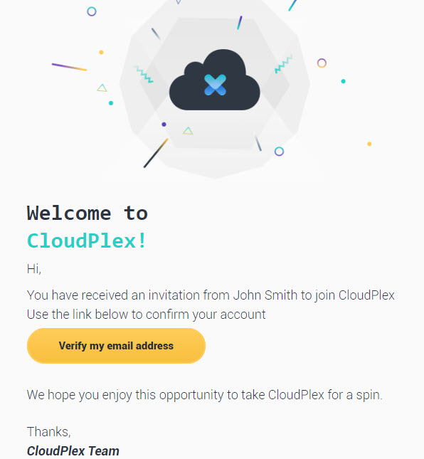
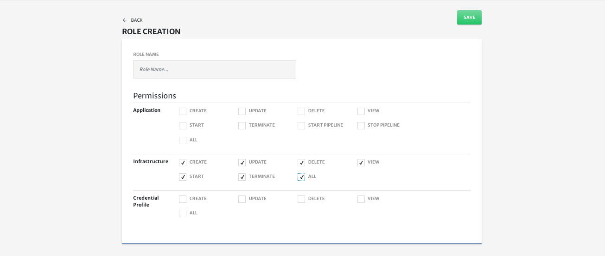

# Access Management
As the name suggests, access management is a module that manages access levels on the platform. The key concept is Role-Based Access Control (RBAC). The function of RBAC is to give appropriate level of permissions to different users of a company based on their unique requirements. 

Access management was designed around enterprise-level needs. There can be several teams working on the same project but each team needs access to only the features or modules required to carry out their tasks. 

Using access management, teams can be created in the platform. Users can be added into the teams with different set of privileges from team lead to normal team member. This makes sure that within every team there is a lead assigning access of only the relevant resources to each team member. 

RBAC is deeply integrated with the platform. After the creation of every resource, i.e. cluster, network, solution etc, the creator will be able to give permissions based on teams. This will make sure that only the teams working on those resources have access. 

Companies that value security try to give only the optimum level of permissions or access to different users. In the security industry, this is known as the principal of least privilege. CloudPlex allows you to follow this best practice throughout the platform. By giving appropriate level of access to the users, the company can only expose limited part of the platform to different users which will secure their account or system from unauthorized access. This can also help in segregation of duties within the team by granting access to only those features needed for the job. 

CloudPlex RBAC consists of **Roles**, **Teams**, and **Users**

**Roles:** A Role is a set of permissions for different modules or resources on the platform e.g. View, Create, Delete permission of Clusters. 

**Team:** A Team is simply a collection of Users and Roles they have been assigned.  A Role can be assigned to one or more Teams and one Team can have multiple roles for different Users. e.g. you can create one Role for full access of Cluster and other Role for full access of Network. You can then assign those two Roles to different Users within the team based on the access level they will be needing to complete their tasks. 

**Users:** On CloudPlex, access is provided to the users based on the Teams they are part of. Users can be assigned Teams depending upon their responsibilities. Users that have been given any kind of access and are part of a team will appear here. 

> **Note:** First time user signing up using a company domain will have **Super User** access of platform.  

> **Note:** Access Management menu will only be available to the Super User and admins of the account. 

> **Note:** RBAC will also be integrated with Active Directory (AD). Users can be fetched from AD and assigned relevant roles in platform. 

Now, let's move to the step by step guide on how to use Access Management. We'll show you how to create a simple team with some users and roles.

## New Company User

As mentioned above, User who will be signing up for the first time using a company domain will have Super User access. Go to the **Access Management** menu from top bar to check the Role from **Users** tab.

## Users

First step would be to add the team players and make the platform accessible to them.

1. Go to the **Access Management** menu from top bar, click **Users** and click **+** button.
   

2. Enter **Email** and click **Add**.

   User will now receive an invitation email along with the confirmation link.

   

   

   > **Note:** All the subsequent New Users will be assigned **Default** role. But you can also change the role assigned, process of which is explained below. 
   >
   > **Note:** Default user role will only have View access. For access of other modules, Super User will need to add the default user in relevant teams and assign the roles.

## Roles

Next step is to create roles that will be later assigned to team members. Platform provides some prebuilt roles for Team Leads and Team Member but you can create custom roles as well. 

To create a new Role:

1. Go to the **Roles** tab.

   Some of the Prebuilt roles will be listed here - Admin, Team Lead, Team Member, Default. You can also create custom roles. 
   
2. To create a new role, click **+** button.

3. Enter **Role Name** and check the access level as per requirement.

   In the picture below, we have created a role for full **App Template** access.
   
4. Click **Save**.

## Teams

Last step is to create Teams and assign relevant role to the Users.

1. Go to the **Teams** tab and click **+** button.

   

2. Enter **Team Name** and click **Add** to add members and assign roles to them.

   You can **Add** multiple entries as well e.g. in the picture below we have added two entries, one for Team Lead and one for Team Member and added members in that. 
   

3. Click **Save**.

## Active Directory

Active Directory menu can be used to fetch the users from AD and make them a part of team in platform.

1. To setup Active Directory, click **+** button.
2. Specify **Host Name** of AD.
3. Specify **Port**.
4. (Optional) Enter **Search Base** to filter the search.
5. Specify **Username** and **Password** of AD.
6. Click **Test AD** button to test the connection.

