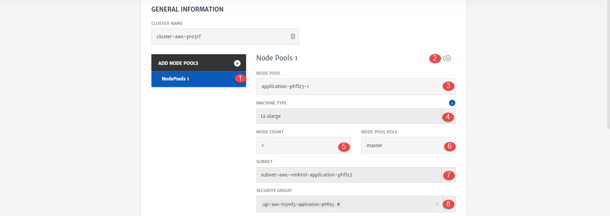

# AWS

A cluster is a group of machines instances or nodes on which the services can be deployed. On amazon, those machines are called Amazon Elastic Compute Cloud EC2. It provides secure, resizable compute capacity in the cloud and is designed to make web-scale cloud computing easier for developers. To know more about EC2, click [here](https://aws.amazon.com/ec2/).

Here are the configurations option that will be available to user while configuring cluster for Application deployment. 

1. **Node Pool**: Pool of nodes and complete Clusterconfigurations for that node. User can add more than 1 Node Pools as well by clicking the **+** icon. 1st node pool will always be Master node pool. All the other node pools will be slave/worker node pools. 

   > Platform provides default values for Master node pools. All the other node pools will need to be configured by the users. 
2. **Clone:** To clone the configurations of current node pool and create another one similar to it. 
3. Name of the **Node Pool**.
4. **Machine Type**: Instance type based on Cloud Provider selected. (To know more about instance types, click [here](https://aws.amazon.com/ec2/instance-types/))
5. **Node Count**: Number of Nodes in the node pool.
6. **Node Pool Role**: Role of node pool i.e. Master or Slave. (First Node Pool will always be master)
7. **Subnet**: Subnet to associate with the node depending on network.
8. **Security Group**: Security Group to associate with the node depending on network.

1. **Key Type**: Key to SSH into nodes i.e. New or Existing.
2. **Enter Key Name**: In case New Key Type is selected.
   After that click **Generate** to get a new key. 
3. **AMI ID**: Image ID that will be used on nodes.
4. **AMI Username**: Username for the image.

1. **Volume Type**: Storage disk type i.e. SSD etc. 

   > **Note:** EBS (Elastic Block Store) is a block level storage which can be mounted to the machines or instances and can then be used as any raw block device.

2. **Volume Size**: Size of the disk in GB.

3. **IOPS**: IOPS for the disk.
   IOPS are a unit of measure representing input/output operations per second. I/O size is capped at 256 KiB for SSD volumes and 1,024 KiB for HDD volumes. To know more about IOPS, click [here](https://docs.aws.amazon.com/AWSEC2/latest/UserGuide/ebs-io-characteristics.html).

4. **Docker Data Volume**: To add docker data volume as well.

   > A data volume is a specially-designated directory within one or more containers that bypasses the Union File System. Data volumes provide several useful features for persistent or shared data.Volumes are initialized when a container is created.

5. Fetch **root volume** of image which is provided as **AMI**.
