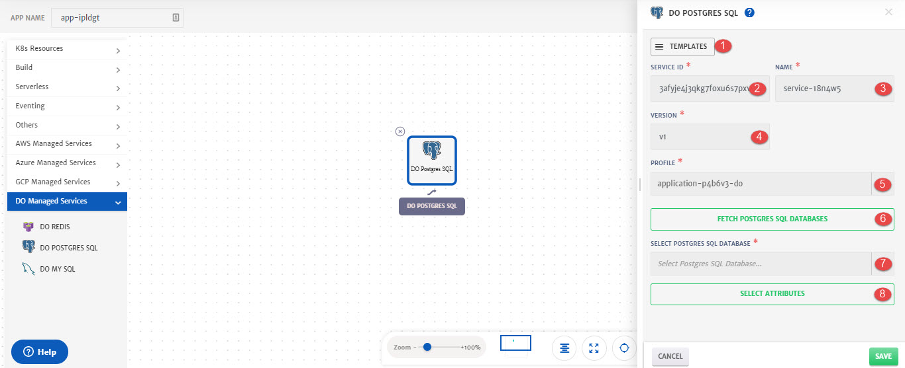

# Digital Ocean

Details of the configurations that can be done for different Digital Ocean (DO) services are explained below and also highlighted in the image.

## Redis

Redis is an open source, key-value database built with an in-memory design that emphasizes speed. It has support for rich data types, atomic operations, and Lua scripting. To know more about DO Redis, click [here](https://www.digitalocean.com/products/managed-databases-redis/). 

While configuring Application, drag and drop **DO Redis** from left pallet and in to the canvas to configure it.

1. **Templates**: To reuse any existing service template.
2. **Service ID:** Id of the service. System will automatically assign id to the service but user can customize it.
3. **Name**: Name for the service.
4. **Version**: Version of the service.
5. **Profile**: Profile to use to fetch the service. 
6. **Fetch Redis Databases**: To fetch all the Redis databases of the selected profile. 
7. **Select Redis Database**: Redis database to fetch the attributes from.
8. **Select Attributes**: To select attributes of the services that will be used as dynamic parameters.

1. **Attributes JSON**: Available Attributes that can be added as dynamic parameters. 
2. **Selected Attributes**: Attributes added that are required as dynamic parameters. Click on the attribute name to add it.

1. **Add Parameters**: To add any static parameter. 

## Postgres SQL

PostgreSQL is an open source, object-relational database built with a focus on extensibility, data integrity, and speed. Its concurrency support makes it fully ACID compliant, and it supports dynamic loading and catalog-driven operations to let users customize its data types, functions, and more. To know more about DO Postgres SQL, click [here](https://www.digitalocean.com/products/managed-databases-postgresql/). 

While configuring Application, drag and drop **DO Postgres SQL** from left pallet and in to the canvas to configure it.

1. **Templates**: To reuse any existing service template.
2. **Service ID:** Id of the service. System will automatically assign id to the service but user can customize it.
3. **Name**: Name for the service.
4. **Version**: Version of the service.
5. **Profile**: Profile to use to fetch the service. 
6. **Fetch Postgres SQL Databases**: To fetch all the Postgres SQL databases of the selected profile. 
7. **Select Postgres SQL Database**: Postgres SQL database to fetch the attributes from.
8. **Select Attributes**: To select attributes of the services that will be used as dynamic parameters.

1. **Attributes JSON**: Available Attributes that can be added as dynamic parameters. 
2. **Selected Attributes**: Attributes added that are required as dynamic parameters. Click on the attribute name to add it.

1. **Add Parameters**: To add any static parameter. 

## My SQL

MySQL is an open source, object-relational database built with speed and reliability in mind. Its large and active developer community has created many third-party applications, tools, and libraries that expand MySQL's functionality. To know more about DO My SQL, click [here](https://www.digitalocean.com/products/managed-databases-mysql/). 

While configuring Application, drag and drop **DO My SQL** from left pallet and in to the canvas to configure it.

1. **Templates**: To reuse any existing service template.
2. **Service ID:** Id of the service. System will automatically assign id to the service but user can customize it.
3. **Name**: Name for the service.
4. **Version**: Version of the service.
5. **Profile**: Profile to use to fetch the service. 
6. **Fetch My SQL Database**: To fetch all the My SQL databases of the selected profile. 
7. **Select My SQL Database**: My SQL database to fetch the attributes from.
8. **Select Attributes**: To select attributes of the services that will be used as dynamic parameters.

1. **Attributes JSON**: Available Attributes that can be added as dynamic parameters. 
2. **Selected Attributes**: Attributes added that are required as dynamic parameters. Click on the attribute name to add it.

1. **Add Parameters**: To add any static parameter. 