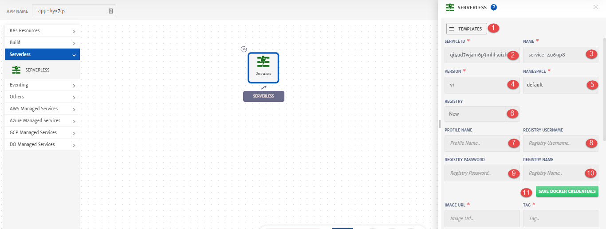

# Serverless

Serverless framework helps developers build serverless applications with less cost and overheads. It provides a powerful and unified experience to develop, deploy and test serverless applications. It basically takes care of the end to end process of application development. 

Serverless applications can be developed and tested on different cloud providers like AWS, Azure and GCP. These applications can then also be secured and monitored. 

CloudPlex has made to it easy deploy serverless applications. Not only deployment, CloudPlex also takes care of the creation process of serverless applications. These serverless applications can also be a part of CloudPlex that can contain services of different types like containers, managed services etc. By making all these different service types a part of single project in CloudPlex, we are making it easier for the user to develop and deploy complex applications using easy to use drag-n-drop interface of platform.

Details of the configurations that can be done for Serverless at Application level are explained below and also highlighted in the image.

1. **Serverless**: Drop-down to add serverless in canvas. 
2. **Serverless Icon**: Drag and drop the service icon to add in canvas. Click on icon to configure the service.

1. **Templates**: To reuse any existing service template.
2. **Service ID:** Id of the service. System will automatically assign id to the service but user can customize it.
3. **Name**: Name for the service.
4. **Version**: Version of the service
5. **Namespace**: Namespace for the service.
6. **Registry**: Drop-down to use a New docker registry or any existing one.
7. **Profile Name:** Profile name to save new registry credentials for future use.
8. **Registry Username** of the registry.
9. **Registry Password** of the registry.
10. **Registry Name**: Name of the docker registry.
11. **Save Docker Credentials**: To save docker registry credentials for future use. 

1. Specify **Image Url**.
2. Specify **Registry Tag**.
3. **Environment Variables**: To add static/dynamic environment variables or Load Balancer.
4. **Minimum Scale:** Minimum scale limit.
5. **Maximum Scale:** Maximum scale limit.
6. **Add Ports**: To add host and ports.
7. To enable **Enforce Internal Communication**.
8. (If **Enforce Internal Communication** is not **Enabled**) **Add Domains** and **Labels**.
