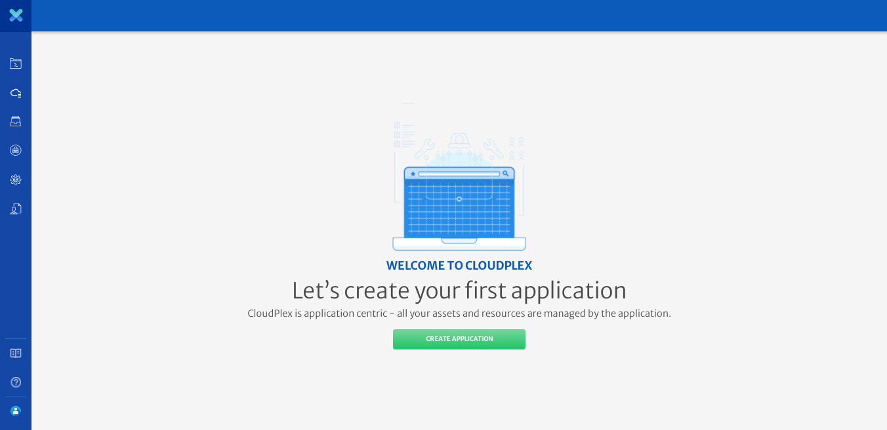
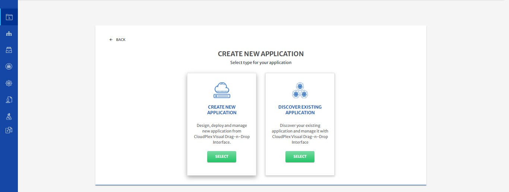

# Getting Started

Welcome to CloudPlex! 

Purpose of this getting started guide is take user through the end to end process of signing up and deployment. We are excited to have you try our platform. Once you are done with this guide, feel free to share your feedback at info@cloudplex.io. For detailed guide on what CloudPlex has to offer click [here](/overview).

Now, lets move to the process of signing up and deployment

1. Go to [app.cloudplex.io/register](https://app.cloudplex.io/register) and sign up for a new account. 

   

2. After email verification, you will be able to login to platform.

   > **Note:** First time user signing up using a company domain will have **Super User** access of platform.  For more details on how super user can invite team members, check our guide on Access Management by clicking [here](/pages/user-guide/components/access-management/access-management).

   

3. Once logged in, click the green **+** icon to start the project creation wizard. 

   

4. Configure the **Basic Info** tab.

   - Enter **Project Name** and **Project ID**.

   - Enter **Description**.

   - Select the **Cloud Provider** and specify necessary account details for the account. (For this guide we have selected AWS)

   - Select **Region** as per requirements.

   - Enter the AWS credentials manually. You can also save this profile for future use. Credentials will be stored in vault i.e. Credentials Profile menu.

     > **Note**: To know more about Credentials Profile menu, click [here](/pages/user-guide/components/credentials-profile/credentials-profile).

   

5. Click **Next** at the top right of screen.

6. Configure **Networks**.

   - Enter **Network Name**.

   - Select **Virtual Private Cloud** from dropdown i.e. **New** or some existing network. (Existing networks will be listed based on AWS account selected)

     > **Note:** We will configure New AWS Network as part of this guide. 

   - Enter **VPC Name**. 

   - Specify **VPC CIDR**.

   

   - To add Subnet, go to the **Subnets** tab, click **+** icon and specify the **Subnet Name** and **CIDR**.

   

   - To add Security Group (SG), go to the **Security Groups** tab.
   - Specify the **SG Name** and **Description**.
     - Click the **+** icon on the **TEST-SG** button to add Traffic Rules. (You can add multiple rules as well)
     - Select the **Rule Type** as per requirement i.e. **Inbound** or **Outbound**.
     - Specify the **IP Protocol** i.e. TCP, UDP etc. 
     - Specify the **Source** and **Destination** **Ports**.
     - Specify the **Port Range** that will be exposed to traffic.
     - Add **IP Ranges** in CIDR notation. 

   

   

7. Click **Next** at the top right of screen.

8. Configure **Clusters**.

   - Enter **Cluster Name** and click **Add Node Pools** button. 

   - Enter **Node Pool** name.

   - Select **Machine Type** from the dropdown and specify **Node Count**.

     > **Note**: 1st node pool is always master pool. So node count will remain 1 for this.

   - Select **Subnet** from dropdown to associate with node pool.

   

   - Select **Security Groups** from dropdown.
   - Select **Key Type** from dropdown i.e. **New** in this case and click **Generate**. A side menu will open, click **Save** and new SSH key will be generated. 
   - Specify the **AMI ID** and **AMI Username**.
   - For **Root Volume** of node, select **Volume Type** from drop-down.
   - Specify the **Volume Size** and **IOPS** for volume. 

   

   - (Optional) Use to toggle button to use **Docker Data Volume** and select the **Volume Type**, **Volume Size** and **IOPS**.
     - Check **Delete on Termination** to delete the volume on Project termination. 

   

9. Click **Next** at the top right of screen.

   1. Configure **Mesh**.

      > **Note**: As part of this guide, we will only configure the minimum settings necessary to deploy the container. For detailed configurations, please check our detailed guide by clicking [here](/pages/user-guide/components/container-services/container-services).

   - Drag and drop the **Container** in the package canvas from left column.

   - Click on **Container** icon to configure the settings.

     - Enter the **Name** and **Version**.
     - Enter **Namespace**.
     - Select the **Type** from drop-down i.e. **Deployment** in this case.

     

     - Set the container **Replica** i.e. 1 in our case.
     - Specify **Image Name** and **Tag**.

     

     - Go to **Environment Variables** menu and add Variable. It is necessary to add at least one which in our case is **MYSQL_ROOT_PASSWORD**

     

     

     - Go to the **Ports**, click **Add Port** button and specify the port for Traffic i.e. **8080**

     

     

     - Click **Save.**

10. Click **Save** (green floppy icon at the top right) to save the project.

   

11. Click the Project, you just created. 

    

12. Click **Start** to deploy the project

    

13. Once a project is deployed, go to the **Logs** tab to check the logs. 

    

14. To check in-depth flow of traffic, go to the **Monitoring** tab.

    

15. 