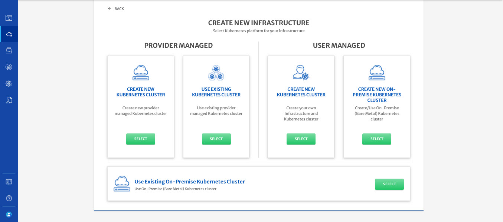

# How to Configure Infrastructure

CloudPlex offers 3 ways of infrastructure creation on the cloud, based on the requirements and expertise level of the user.

Go to the Infrastructure menu from left pane and click **+** button to start the creation process.

1. Provider Managed
   To setup a cloud provider (AWS, Azure etc) managed Kubernetes cluster on CloudPlex.

   - Create New Kubernetes Cluster To create new provider managed Kubernetes cluster from scratch

   - Use Existing Kubernetes Cluster

     This option can be used for the following 2 use cases

     1. To manage and deploy apps on any existing provider managed kubernetes cluster using CloudPlex
     2. To migrate application from any existing kubernetes cluster to CloudPlex. User can then add new services to the application or migrate that to any other cloud.

2. User Managed
   To build whole infrastructure and Kubernetes from scratch using CloudPlex intuitive user interface.

   - Create New Kubernetes Cluster To setup a new infrastructure and kubernetes cluster from scratch.
   - Create New On-Premise Kubernetes Cluster To use On-Premise machines to create a Kubernetes cluster.

3. Clone Existing Application
   This feature is recommended when the users want to deploy an application having the same configurations or after making minute changes on any existing applications.

For a step by step guide on how to configure and manage different type of kubernetes cluster using CloudPlex, navigate to the respective guide below.

> To deploy on application on cloud, it is necessary for the user cloud profile to have all the required permissions. For detailed guide on all the required permissions, click [here](https://docs.cloudplex.io/#/pages/user-guide/components/cloud-authorization-level/cloud-authorization-level).

1. [Provider Managed - New Kubernetes Cluster](https://docs.cloudplex.io/#/pages/user-guide/getting-started/pm-new-cluster/pm-new-cluster?id=provider-managed-new-kubernetes-cluster)
2. [Provider Managed - Existing Kubernetes Cluster](https://docs.cloudplex.io/#/pages/user-guide/getting-started/pm-existing-cluster/pm-existing-cluster?id=provider-managed-existing-kubernetes-cluster)
3. [User Managed - New Kubernetes Cluster](https://docs.cloudplex.io/#/pages/user-guide/getting-started/um-new-cluster/um-new-cluster?id=user-managed-new-kubernetes-cluster)
4. [User Managed - New On-Premise Kubernetes Cluster](https://docs.cloudplex.io/#/pages/user-guide/getting-started/um-new-op-cluster/um-new-op-cluster?id=user-managed-new-on-premise-kubernetes-cluster)

