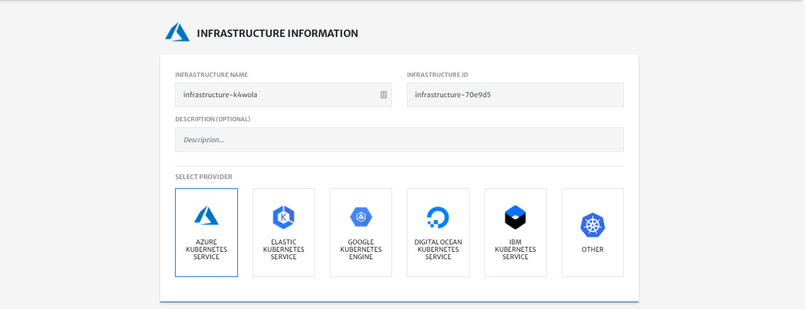
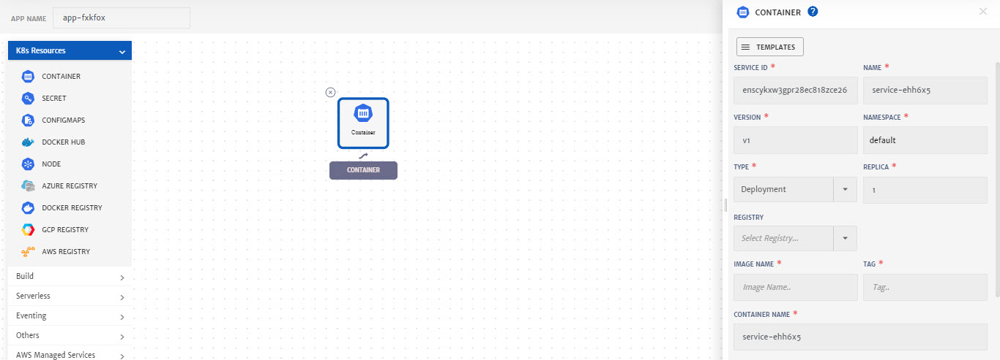

## Provider Managed - Existing Kubernetes Cluster

> To deploy on application on cloud, it is necessary for the user cloud profile to have all the required permissions. For detailed guide on all the required permissions, click [here](/pages/user-guide/components/cloud-authorization-level/cloud-authorization-level).

1. **Select** Use Existing Kubernetes Cluster from Provided Managed section.  

2. Configure the **Basic Info** tab. (Platform provides default values for most of the parameters)

   - Select the **Cloud Provider**. (For this guide we have selected Azure Kubernetes Service)

   

3. Click **Next** at the top right of screen.

4. Configure **Cluster**.
   From here you can connect your existing kubernetes cluster with CloudPlex.  

   - Download YML file. 

   - Configure kubectl (client) with your existing kubernetes cluster that you want to import. 

   - Run following command on downloaded YML file. 

     ```
     kubectl apply -f agent.yml
     ```

   > Download Config file of the cluster from the cloud and apply agent on that as shown in the picture below.

   

   - Once pod is in running state, click **Verify Connect** to verify the connection with cluster. 

   

5. Click **Next** at the top right of screen.

6. Select **App Type**.
   **Select New Application**: To deploy new CloudPlex managed application on existing kubernetes cluster. (creating new application as part of this guide)
   **Select Existing Application:** To migrate application from any kubernetes cluster to CloudPlex. 

   

7. Click **Next** at the top right of screen.

8. Design application using **App Designer**.

   > As part of this guide, we will only configure the minimum settings necessary to deploy the container. For detailed configurations, please check our detailed guide by clicking [here](/pages/user-guide/components/k8s-resources/container/container).

   - Drag and drop the **Container** service in K8s resources from left column in to the canvas.

   - Click on **Container** icon to configure the settings. (Platform has provided default values for most of the parameters) 

     - Specify **Image Name** and **Tag**.

     

     - Go to **Environment Variables** menu and **Add Static** Variable. It is necessary to add at least one variable which in our case is **MYSQL_ROOT_PASSWORD**.

     

     - Go to the **Ports**, click **Add Port** button and specify the port for Traffic i.e. **8080**.

     

     - Click **Save.**

9. Click **Save** (green floppy icon at the top right) to save the application.

   

10. Click **Start** to deploy the application.

    

11. Once an application is started, platform automatically redirect to **Logs** tab. Logs help in monitoring of different phases of application deployment.

    

12. To check in-depth flow of traffic, go to the **Monitoring** tab.

    
