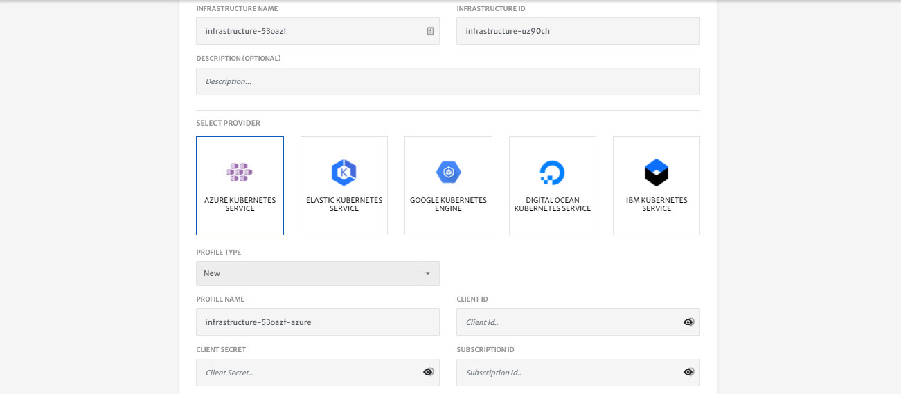

## Provider Managed - New Kubernetes Cluster

> To deploy an application on cloud, it is necessary for the user cloud profile to have all the required permissions. For detailed guide on all the required permissions, click [here](/pages/user-guide/components/cloud-authorization-level/cloud-authorization-level).

1. **Select** Create New Kubernetes Cluster from Provided Managed section.  

2. Configure the **General** tab. (Platform provides default values for most of the parameters)

   - Select the **Cloud Provider** and specify necessary account details for the account. (For this guide we have selected Azure Kubernetes Service)

   - Enter **Profile Name** and specify the Azure profile credentials (Client ID, Client Secret, Subscription ID, Tenant ID). You can also save this profile for future use. Credentials will be stored in vault i.e. Credentials Profile menu.

     > To know more about Credentials Profile menu, click [here](/pages/user-guide/components/credentials-profile/credentials-profile).
     >
     > To perform different functions and to deploy application using CloudPlex, it is necessary to have required permissions on cloud. To know about all those permissions click [here.](pages/user-guide/components/cloud-authorization-level/cloud-authorization-level?id=cloud-authorization-level)

   

3. Click **Next** at the top right of screen.

4. Configure Cluster.

   - Enter **Cluster Name**.

   - Select Machine Type from drop-down. (To know more about machine types click [here](https://azure.microsoft.com/en-us/pricing/details/virtual-machines/series/))

     > Minimum 4 CPU machine is needed for deployment. 

   - Specify **Node Count**.

   - (Optional) Enable **Custom Advance Settings** using radio button.

     > To configure advanced settings for Clusters, click [here](/pages/user-guide/components/cluster/pm-new-cluster/pm-new-cluster).

   

5. Click **Next** at the top right of screen.

6. Design application using **App Designer**.

   > As part of this guide, we will only configure the minimum settings necessary to deploy the container. For detailed configurations, please check our detailed guide by clicking [here](/pages/user-guide/components/k8s-resources/container/container).

   - Drag and drop the **Container** service in K8s resources from left column in to the canvas.

   - Click on **Container** icon to configure the settings. (Platform has provided default values for most of the parameters) 

     - Specify **Image Name** and **Tag**.

     

     - Go to **Environment Variables** menu and **Add Static** Variable. It is necessary to add at least one variable which in our case is **MYSQL_ROOT_PASSWORD**.

     

     - Go to the **Ports**, click **Add Port** button and specify the port for Traffic i.e. **8080**.

     

     - Click **Save.**

7. Click **Save** (green floppy icon at the top right) to save the application.

   

8. Click **Start** to deploy the application.

   

9. Once an application is started, platform automatically redirect to **Logs** tab. Logs help in monitoring of different phases of application deployment.

   

10. To check in-depth flow of traffic, go to the **Monitoring** tab.

    
