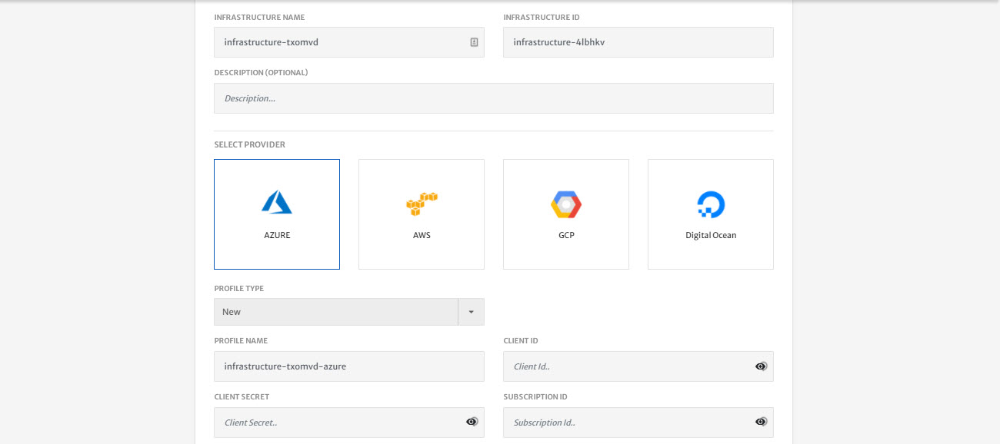
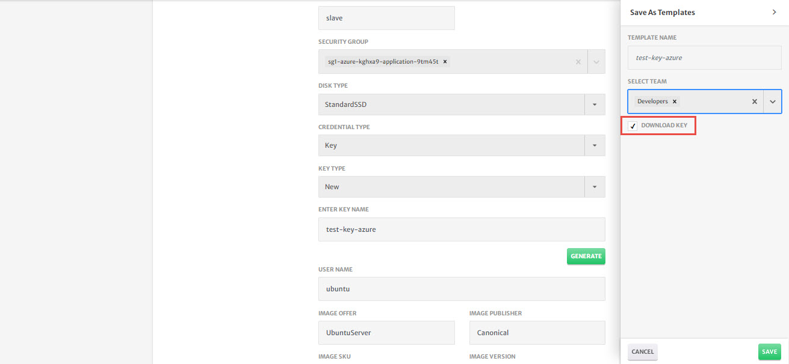

## User Managed - New Kubernetes Cluster

1. **Select** Create New Kubernetes Cluster from User Managed section.  

2. Configure the **Basic Info** tab. (Platform has provided default values for most of the parameters)

   - Select the **Cloud Provider** and specify necessary account details for the account. (For this guide we have selected Azure)

   - Enter **Profile Name** and specify the Azure profile credentials (Client ID, Client Secret, Subscription ID, Tenant ID). You can also save this profile for future use. Credentials will be stored in vault i.e. Credentials Profile menu.

     > To know more about Credentials Profile menu, click [here](/pages/user-guide/components/credentials-profile/credentials-profile).
     >
     > To perform different functions and to deploy application using CloudPlex, it is necessary to have required permissions on cloud. To know about all those permissions click [here.](pages/user-guide/components/cloud-authorization-level/cloud-authorization-level?id=cloud-authorization-level)

   

3. Click **Next** at the top right of screen.

4. Customize Network configurations as per requirements.

   > **Note:** Most of the fields are prepopulated with default values but you can also customize the configurations as per your requirements. 

   - Specify VPC **CIDR**.
   - Specify Subnet **CIDR**. (You can also add multiple subnets by clicking the **+** icon)

   

   - (Optional) Go to **Security Groups** tab, to add Inbound or Outbound traffic rules. 
     Platform provides preconfigured traffic rules, but you can customize them as per the requirements.

   

5. Click **Next** at the top right of screen.

6. Configure **Cluster**.

   - Most of the fields are preconfigured, but you can also customize them.
   - Select **Credential Type** from dropdown, i.e. **Key** in this case, select **Key Type** i.e. **New**, **Enter Key Name** and click **Generate**. A side menu will open, click **Save** and new SSH key will be generated. 

     > While saving the key, you can also download the key for future use by checking **Download Key** option.

   

   

7. Click **Next** at the top right of screen.

8. (Optional) Configure **Kubernetes**.

   - Select **Kubernetes, Istio, Knative Version** from drop-down to install on cluster.

   - Specify **Pod Address Range** that will be assigned to the pods in cluster.

   - Use Radio buttons to enable **Load Balancing** and **Network Policy**.

     > Before deploying application, system will first install kubernetes on cluster.

   

9. Click **Next** at the top right of screen.

10. Design application using **App Designer**.

    > As part of this guide, we will only configure the minimum settings necessary to deploy the container. For detailed configurations, please check our detailed guide by clicking [here](/pages/user-guide/components/k8s-resources/container/container).

    - Drag and drop the **Container** service in K8s resources from left column in to the canvas.

    - Click on **Container** icon to configure the settings. (Platform has provided default values for most of the parameters) 

      - Specify **Image Name** and **Tag**.

      

      - Go to **Environment Variables** menu and **Add Static** Variable. It is necessary to add at least one variable which in our case is **MYSQL_ROOT_PASSWORD**.

      

      - Go to the **Ports**, click **Add Port** button and specify the port for Traffic i.e. **8080**.

      

      - Click **Save.**

11. Click **Save** (green floppy icon at the top right) to save the application.

    

12. Click **Start** to deploy the application.

    

13. Once an application is started, platform automatically redirect to **Logs** tab. Logs help in monitoring of different phases of application deployment.

    

14. To check in-depth flow of traffic, go to the **Monitoring** tab.

    