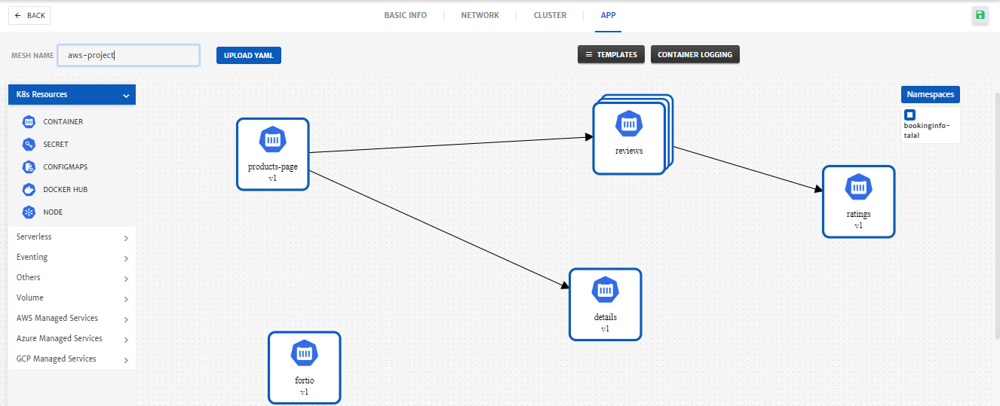
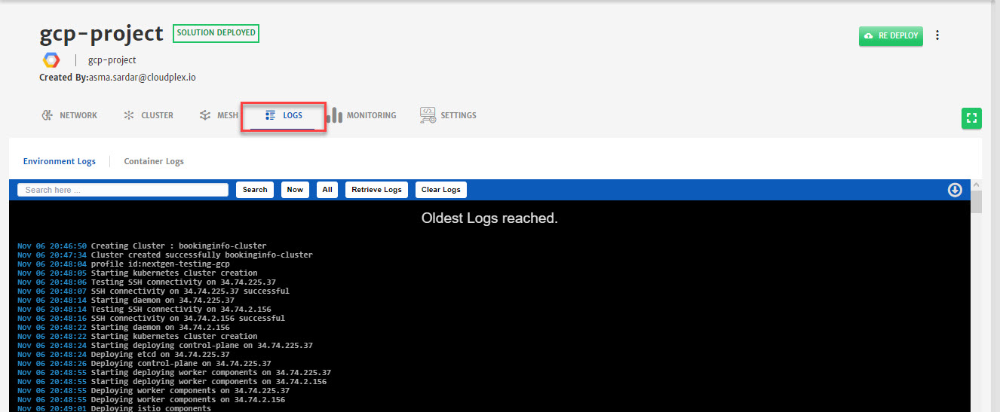
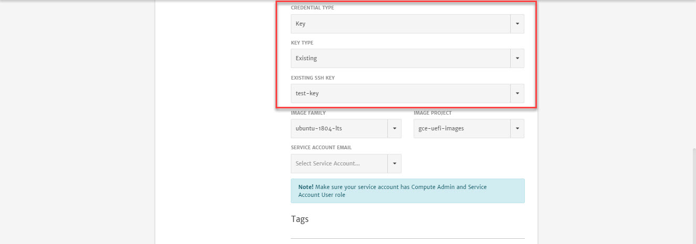
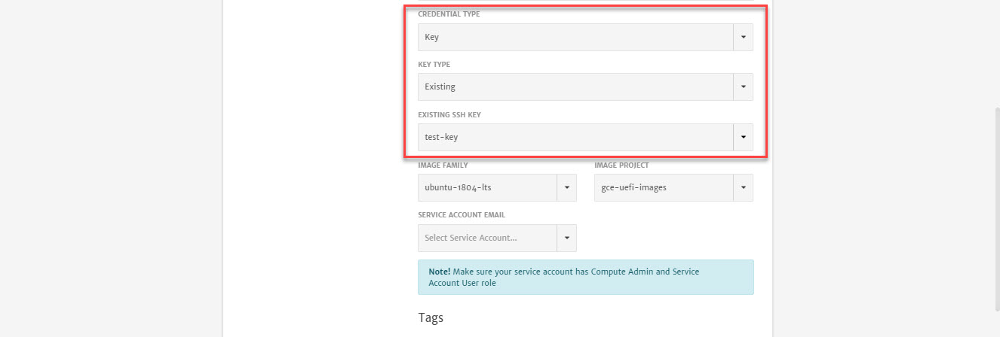
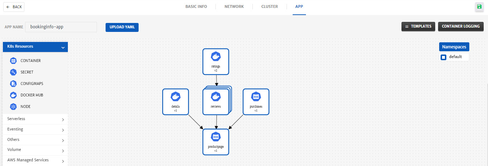

# CloudPlex Training Labs

Welcome to CloudPlex! 

Purpose of these labs is to take user through the end to end process of deployment using prebuilt templates that CloudPlex provides to its new users so that they can get up to speed in no time. Deployment using existing templates will take less than 15 minutes. 

## Lab 1 (AWS) (BookingInfo)

1. Once logged in, click the green **+** icon to start the project creation wizard. 

   

2. Configure the **Basic Info** tab.

   - Enter **Project Name** and **Project ID**.

   - Enter **Description**.

   - Select the **Cloud Provider** and specify necessary account details for the account. (For this guide we have selected AWS)

   - Select **Asia Pacific (Singapore)** as **Region**.

     > **Note:** Region is selected as per AMI which will be selected while configuring the cluster.

   - Enter the AWS credentials manually. You can also save this profile for future use. Credentials will be stored in vault i.e. Credentials Profile menu.

     > **Note**: To know more about Credentials Profile menu, click [here](/pages/user-guide/components/credentials-profile/credentials-profile).

   

3. Click **Next** at the top right of screen.

4. Click **Templates** button to get the list of existing/prebuilt network templates. 

   > Select **testforaws1** template.

   

   

5. Click **Next** at the top right of screen.

6. Click **Templates** button to get the list of existing/prebuilt cluster templates.

   > Select **aws-1** template. Most of fields will automatically get populated on selecting a template.  Other required configurations are explained below.

   

   - Select **Subnet** and **Security Groups** from drop-down.

     > **Note**: You can use any subnet listed in drop-down

     

   - Select **New** from **Key Type** dropdown, enter **Key Name** and click **Generate**. A side menu will open, click **Save** and new SSH key will be generated. 

     

   - Now, select 2nd node pool and select the **Subnet** and **Security Group** from drop-down.

     

   - Select **Existing** from **Key Type** drop-down and then select the key (which we generated while configuring the 1st node pool) from **Existing SSH Key** drop-down.

     

7. Click **Next** at the top right of screen.

8. Enter **App Name** and click **Templates** button to get the list of existing/prebuilt app templates.

   > Select **bookinfoapp** template

   

   

9. Click **Save** (green floppy icon at the top right) to save the project.

   

10. Click the Project, you just created. 

    

11. Click **Start** to deploy the project

    

12. Once a project is deployed, go to the **Logs** tab to check the logs. 

    

13. To check in-depth flow of traffic, go to the **Monitoring** tab.

    

14. Don't forget to terminate the project to avoid incurring extra cloud charges. 

    

## Lab 2 (GCP) (BookingInfo From Scratch)

1. Once logged in, click the green **+** icon to start the project creation wizard. 

   

2. Configure the **Basic Info** tab.

   - Enter **Project Name** and **Project ID**.

   - Enter **Description**.

   - Select the **Cloud Provider** and specify necessary account details for the account. (For this guide we have selected GCP)

   - From **Profile** drop-down select **New** and enter the **Profile Name**.

   - Upload a **GCP Profile**. (To know more about this click [here](https://cloud.google.com/iam/docs/creating-managing-service-account-keys))

     > **Note:** You can also save this profile for future use by clicking **Save Profile** button. Credentials will be stored in vault i.e. Credentials Profile menu. To know more about Credentials Profile menu, click [here](/pages/user-guide/components/credentials-profile/credentials-profile).

   - Select  **South Carolina US** as **Region** and any **Zone** from drop-down.

     > **Note:** Region is selected as per AMI which will be selected while configuring the cluster.

     

3. Click **Next** at the top right of screen.

4. Click **Templates** button to get the list of existing/prebuilt network templates. 

   > Select **testforgcp2** template.

   

   

5. Click **Next** at the top right of screen.

6. Click **Templates** button to get the list of existing/prebuilt cluster templates.

   > Select **gcp-1** template. Most of fields will automatically get populated on selecting a template.  Other required configurations are explained below.

   

   - Select **Subnet** from drop-down.

     > **Note**: You can use any subnet listed in drop-down

   - Enter **Username**. You can set any username e.g. ubuntu.

     

   - Select **Key** from **Credential Type** drop-down, **New** from **Key Type** dropdown, enter **Key Name** and click **Generate**. A side menu will open, click **Save** and new SSH key will be generated. 

   - Select **Service Account Email** from drop-down. Emails will be listed based on profile provided while configuring the **Basic Info** tab. Emails should have the necessary access as shown in image below.

     

     

   - Now, select 2nd node pool and select the **Subnet** from drop-down.

   - Enter **Username**. You can set any username e.g. ubuntu.

     

   - Select **Key** from **Credential Type** drop-down, **Existing** from **Key Type** dropdown and select the key (which we generated while configuring the 1st node pool) from **Existing SSH Key** drop-down.  

   - Select **Service Account Email** from drop-down.

     

7. Click **Next** at the top right of screen.

8. Enter **App Name** and add (simply drag and drop the services) following **K8s resources**.  

   - 4 **Container** Service

   - 2 **Docker Hub** Services

      

   - Click on service icon to open the side menu for configurations and repeat this step for all the services. Configurations for each service can be found [here](https://docs.google.com/document/d/16jgpxSL216mlZyMmoWA127WyUR9BRnjr9P3R1cKrMN0/edit?usp=sharing).

   - Once the configurations are done, create dependencies (click the service icon, drag and drop using the arrow icon shown below every service) between services as shown below

      > **Note**: Reviews services will get grouped automatically.

      - productpage to reviews service
      - productpage to details service
      - reviews to ratings service

      

9. Click **Save** (green floppy icon at the top right) to save the project.

   

10. Click the Project, you just created. 

    

11. Click **Start** to deploy the project

    

12. Once a project is deployed, go to the **Logs** tab to check the logs. 

    

13. Don't forget to terminate the project to avoid incurring extra cloud charges. 

    

## Lab 3 (AWS) (Hipstershop)

1. Once logged in, click the green **+** icon to start the project creation wizard. 

   

2. Configure the **Basic Info** tab.

   - Enter **Project Name** and **Project ID**.

   - Enter **Description**.

   - Select the **Cloud Provider** and specify necessary account details for the account. (For this guide we have selected AWS)

   - Select **Asia Pacific (Singapore)** as **Region**.

     > **Note:** Region is selected as per AMI which will be selected while configuring the cluster.

   - Enter the AWS credentials manually. You can also save this profile for future use. Credentials will be stored in vault i.e. Credentials Profile menu.

     > **Note**: To know more about Credentials Profile menu, click [here](/pages/user-guide/components/credentials-profile/credentials-profile).

   

3. Click **Next** at the top right of screen.

4. Click **Templates** button to get the list of existing/prebuilt network templates. 

   > Select **testforaws1** template.

   

   

5. Click **Next** at the top right of screen.

6. Click **Templates** button to get the list of existing/prebuilt cluster templates.

   > Select **aws-1** template. Most of fields will automatically get populated on selecting a template.  Other required configurations are explained below.

   

   - Select **Subnet** and **Security Groups** from drop-down.

     > **Note**: You can use any subnet listed in drop-down

     

   - Select **New** from **Key Type** dropdown, enter **Key Name** and click **Generate**. A side menu will open, click **Save** and new SSH key will be generated. 

     

   - Now, select 2nd node pool and select the **Subnet** and **Security Group** from drop-down.

     

   - Select **Existing** from **Key Type** drop-down and then select the key (which we generated while configuring the 1st node pool) from **Existing SSH Key** drop-down.

     

7. Click **Next** at the top right of screen.

8. Enter **App Name** and click **Templates** button to get the list of existing/prebuilt app templates.

   > Select **hipstershop-app-template** template

   

   

9. Click **Save** (green floppy icon at the top right) to save the project.

   

10. Click the Project, you just created. 

    

11. Click **Start** to deploy the project

    

12. Once a project is deployed, go to the **Logs** tab to check the logs. 

    

13. To check in-depth flow of traffic, go to the **Monitoring** tab.

    

14. Don't forget to terminate the project to avoid incurring extra cloud charges. 

    

## Lab 4 (GCP) (BookingInfo Application)

1. Once logged in, click the green **+** icon to start the project creation wizard. 

   

2. Configure the **Basic Info** tab.

   - Enter **Project Name** and **Project ID**.

   - Enter **Description**.

   - Select the **Cloud Provider** and specify necessary account details for the account. (For this guide we have selected GCP)

   - From **Profile** drop-down select **New** and enter the **Profile Name**.

   - Upload a **GCP Profile**. (To know more about this click [here](https://cloud.google.com/iam/docs/creating-managing-service-account-keys))

     > **Note:** You can also save this profile for future use by clicking **Save Profile** button. Credentials will be stored in vault i.e. Credentials Profile menu. To know more about Credentials Profile menu, click [here](/pages/user-guide/components/credentials-profile/credentials-profile).
     >
     > **Note**: You can use AWS or Azure cloud providers as well based on your requirements. 

   - Select  **South Carolina US** as **Region** and any **Zone** from drop-down.

     > **Note:** Region is selected as per AMI which will be selected while configuring the cluster.

     

3. Click **Next** at the top right of screen.

4. Click **Templates** button to get the list of existing/prebuilt network templates. 

   > Select **testforgcp2** template.

   

   

5. Click **Next** at the top right of screen.

6. Click **Templates** button to get the list of existing/prebuilt cluster templates.

   > Select **gcp-1** template. Most of fields will automatically get populated on selecting a template.  Other required configurations are explained below.

   

   - Select **Subnet** from drop-down.

     > **Note**: You can use any subnet listed in drop-down

   - Enter **Username**. You can set any username e.g. ubuntu.

     

   - Select **Key** from **Credential Type** drop-down, **New** from **Key Type** dropdown, enter **Key Name** and click **Generate**. A side menu will open, click **Save** and new SSH key will be generated. 

   - Select **Service Account Email** from drop-down. Emails will be listed based on profile provided while configuring the **Basic Info** tab. Emails should have the necessary access as shown in image below.

     

     

   - Now, select 2nd node pool and select the **Subnet** from drop-down.

   - Enter **Username**. You can set any username e.g. ubuntu.

     

   - Select **Key** from **Credential Type** drop-down, **Existing** from **Key Type** dropdown and select the key (which we generated while configuring the 1st node pool) from **Existing SSH Key** drop-down.  

   - Select **Service Account Email** from drop-down.

     

7. Click **Next** at the top right of screen.

8. Enter **App Name** and add (simply drag and drop the services) following **K8s resources**.  

   - 2 **Container** Service

   - 5 **Docker Hub** Services

     

   - Click on service icon to open the side menu for configurations and repeat this step for all the services. Configurations for each service can be found [here](https://docs.google.com/document/d/16jgpxSL216mlZyMmoWA127WyUR9BRnjr9P3R1cKrMN0/edit#heading=h.f22gi11xb34b).

   - Once the configurations are done, create dependencies (click the service icon, drag and drop using the arrow icon shown below every service) between services as shown below

     > **Note**: Reviews services will get grouped automatically.

     - ratings to reviews service
     - details to productpage service
     - purchases to productpage service
     - reviews to productpage service

     

9. Click **Save** (green floppy icon at the top right) to save the project.

   

10. Click the Project, you just created. 

    

11. Click **Start** to deploy the project

    

12. Once a project is deployed, go to the **Logs** tab to check the logs. 

    

13. Don't forget to terminate the project to avoid incurring extra cloud charges. 

    