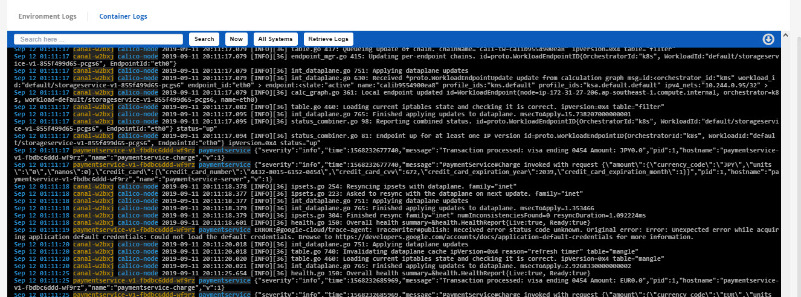
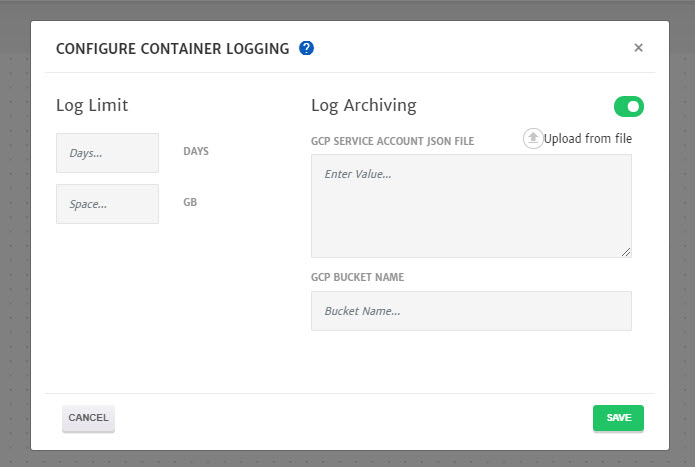

# Container Logging

Container Logging modules gives detailed logs for all the containers that are part of an app. Kibana is implemented for logs. 

User can also search for specific log using the search bar and can also retrieve logs using a snapshot. 

Mostly multiple containers will be part of an app, so user can also get the logs of any specific container using All Systems drop-down. 

> Once an Application is deployed, platform automatically redirects the user to Logs tab. User can also access Logs, by selecting any deployed application from Applications module and going to the **Logs** tab.

# Logs Archiving

There is a feature of logs archiving in platform. Container logs usually end up taking a lot of space and are not always required. So to take care of this, we have developed a feature of logs archiving. Using this, you can decide how much logs do you want to store and when to store them in cloud storage. Once the logs are archived they will be deleted from the project in platform.

To configure Logs Archiving:

1.  Click **Container Logging** button while configuring the **App**. 

   

2. Enable **Log Archiving** using the radio button. 

3. Provide or upload **GCP Service Account JSON File** to access storage and specify the **GCP Bucket Name** in which the logs will be stored. 

   > **Note:** Bucket should already be created and available on GCP. 

4. **Log Limit** decides when and how much logs will be archived in the bucket. 

   > **Log Limit Days** specify the days after which the logs will start archiving in to the bucket. 7 days in picture below specify that at any given time only 7 days logs will be available in the project. All the logs of 8th day an above will automatically be removed from the project after getting archived in the bucket.
   >
   > **Log Limit GB** specify the storage space in GB after which the logs will be archived in bucket. 5 GB in the picture below specify that at any given time only 5 GB of logs will be available in the project. All the logs that will be generated once the 5 GB limit is reached will automatically be removed after getting archived in the bucket.
   >
   > **Note:** In the image below, even thought the days mentioned are 7 but still if logs reach 5GB storage threshold before 7th day, logs will get archived. 

   

5. 

